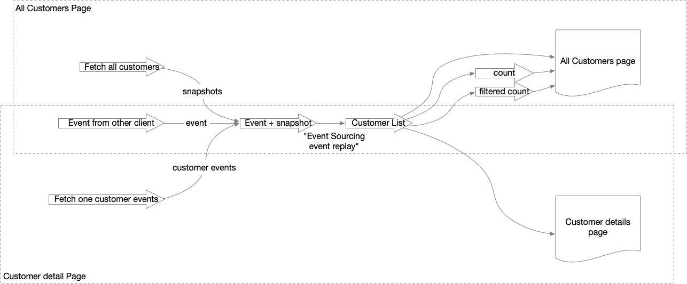
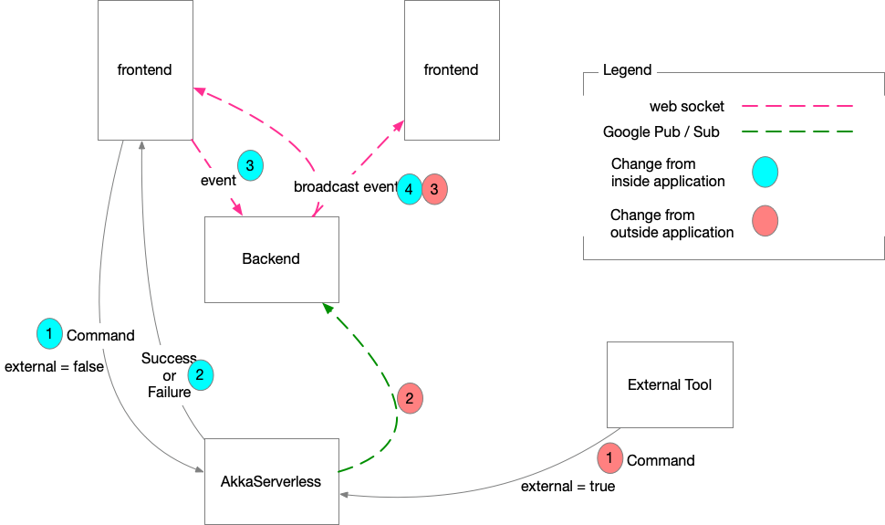

# akkaserverless-laminar

Small Single Page Application using [Scala.js](http://www.scala-js.org/) and [Laminar](https://laminar.dev/). This client app connect to an [Akka Serverless](https://www.lightbend.com/akka-serverless) backend [application](https://github.com/domschoen/akkaserverless). It manages customers (create new customer, rename customer).

We show here an event driven approach for client application:  Event Sourcing, Event Stream (Laminar), push event through web socket to maintain client  up to date with backend.

# Purpose

Laminar is the perfect tool to define Event Sourcing at client side. We use an event stream of events piped to a Signal of list of customers which is the base for the display. A customer is this list contains:

- Name
- Region
- Country
- Audit trail which is a list of event (CustomerCreated, CustomerRenamed)

The event stream is supplied with events from 3 possible sources:

- All customers fetched from Akka serverless application using REST call (This is done when we display the main page displaying all customers)
- All events of one particular customer fetched from Akka serverles application using REST call  (this is done when we display a customer details page)
- Event from any change made in another client (this other client send the event to Laminar backend which is then broadcasted to all SPA instances using web socket)

As a summary, this below diagram show the event flow of this application :



Once all these streams are connected, everything is updated automatically ! Great !

No cache to manage, it's all done by Laminar. After serverless, welcome to clientless !

# Keep SPA up to date with changes




## Subscription to Google Pub / Sub topic

It is disabled by default. You need to configure it in Google Cloud as specified: [https://developer.lightbend.com/docs/akka-serverless/projects/message-brokers.html](https://eur02.safelinks.protection.outlook.com/?url=https%3A%2F%2Fdeveloper.lightbend.com%2Fdocs%2Fakka-serverless%2Fprojects%2Fmessage-brokers.html&data=04|01|dominique.schoenenberger%40nagra.com|1bb438a486bb419fe17608d9b57eb487|e573309544254f08b6ba487b9a46a425|0|0|637740378057495825|Unknown|TWFpbGZsb3d8eyJWIjoiMC4wLjAwMDAiLCJQIjoiV2luMzIiLCJBTiI6Ik1haWwiLCJXVCI6Mn0%3D|3000&sdata=SkYZNibQrRZCtKoZM2whu%2F90ripe3tfofvP7VS2rmlA%3D&reserved=0)

And in application.conf of the backend of the project in this section (this is an example):

```
  googlepubsub {
    enabled     = false
    projectId   = "akkaserverlesstopic"
    apiKey      = "xxxxxxexxxxxxxxxxxxxxxxxxxxxxxxxxxxxx"
    topic = "CustomerRepTopic"
    subscription = "CustomerRepTopic-sub"
  }
```


# Authentication

This application is intended to be used with Azure Authentication but by default it is disabled. 

If you want to set it, you need to change the following section of "frontend-config/dev/index.js" and/or "frontend-config/prod/index.js" (this is an example):

```
module.exports = {
  config: {
    useAuthentication: true,
    defaultUser: "firstname.lastname@example.com",
    msal: {
        authRedirectUrl: "https://url",
        authority: "https://login.microsoftonline.com/xxxxxx-xxxx-xxxx-xxxx-xxxxxxxxxxx",
        clientId: "xxxxxxx-xxxx-xxxx-xxxx-xxxxxxxxxx"
    }
  },

```

# Akkaserverless

The following Akkaserverless should be running. 

You can run it locally or in the cloud and you need to specify it the following section of "frontend-config/dev/index.js" and/or "frontend-config/prod/index.js" (this is an example):

```
module.exports = {
  config: {
    akkaserverless: {
      useCloud = true,
      cloudHostURL = "https://super-star-1234.us-east1.akkaserverless.app",
      localHostURL = "http://localhost:9000"
    }
  },
```


# Running

## Front-end

Install npm dependencies:

```
npm install
```

Build the front-end:

```
sbt frontend/fastLinkJS
```

Start the webpack dev server:

```
npm start
```

## Back-end

Start sbt:

```
sbt
```

Within sbt start the back-end app:

```
sbt> backend/reStart
```

## Open 

Open http://localhost:3000 in the browser.

**Important Note**: If you run akka serverless locally, you to run Chrome by disabling CORS check when working with local URLs

open -n -a /Applications/Google\ Chrome.app/Contents/MacOS/Google\ Chrome --args --user-data-dir="/tmp/chrome_dev_test" --disable-web-security

# Developing

To make sbt re-compile the front-end on code changes:

```
sbt ~frontend/fastLinkJS
```

To re-compile and restart the back-end on code changes:

```
sbt ~backend/reStart
```

# Prod build

Build an optimized js for the front-end:

```
sbt frontend/fullLinkJS
```

Run the npm:

```
npm run build:prod
```

The front end assets will be generated into the `dist` folder.

## Testing

testing with jest is currently broken


